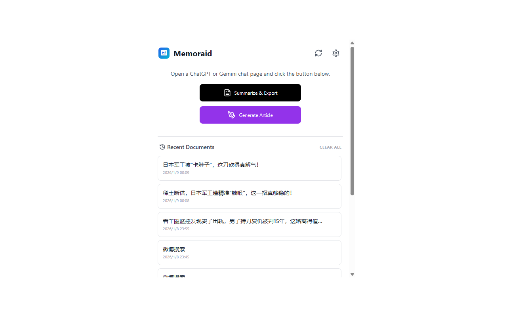
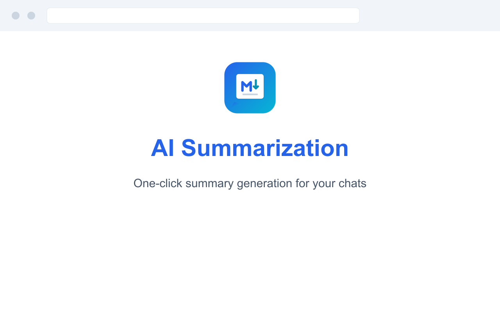
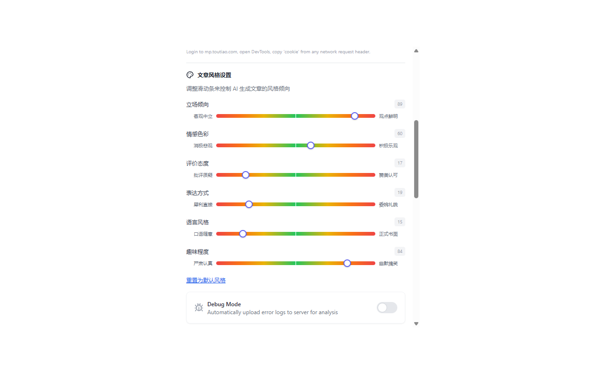
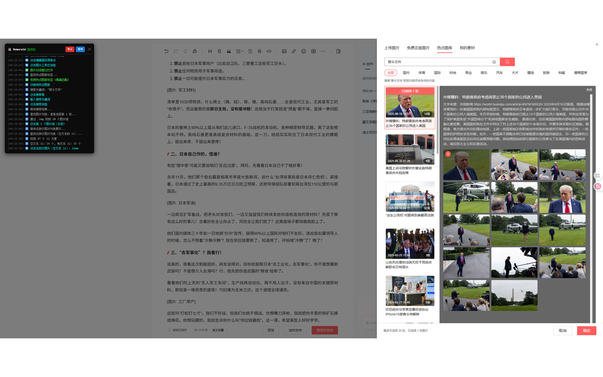
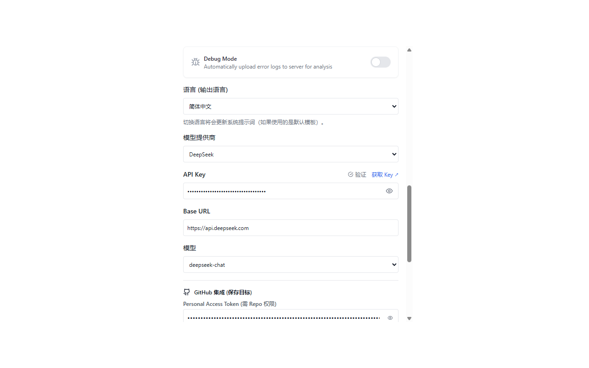
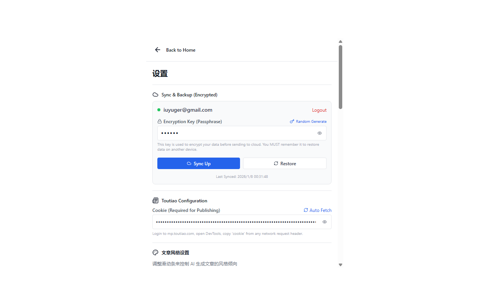

# Memoraid

一个面向中文创作者的 Chrome 扩展：提取网页内容、AI 生成文章、并一键发布到主流内容平台。

<div align="center">
  
</div>

[Chrome 应用商店安装](https://chromewebstore.google.com/detail/memoraid/leonoilddlplhmmahjmnendflfnlnlmg?hl=zh-CN&utm_source=ext_sidebar) |
[问题反馈](https://github.com/ralph-wren/memoraid/issues) |
[隐私政策](https://memoraid.dpdns.org/privacy)

## 最近更新 (v1.3.0)

- 新增定时任务：可自动抓取内容并定时发布。
- 新增额度体系：支持免费额度 + 充值额度。
- 新增用户反馈模块：支持提交、查看与处理反馈。
- 新增统计视图：支持 Token 消耗、文章统计与排行榜。
- 优化多平台稳定性和整体 UI 响应体验。

## 核心能力

- 智能提取：支持网页正文提取和 AI 对话内容提取（ChatGPT/Gemini/DeepSeek 等）。
- AI 生成：可生成技术文档或自媒体文章，支持多种主流模型。
- 风格可控：提供 6 维度滑条，调节语气、立场、情感与表达方式。
- 一键发布：支持头条号、知乎专栏、微信公众号、小红书等平台自动填充。
- 数据管理：支持历史记录、云端加密同步、GitHub 导出与数据统计。

## 30 秒快速开始

1. 在 Chrome 应用商店安装 Memoraid。
2. 打开扩展设置，选择 AI 提供商并填入 API Key。
3. 打开任意网页，点击 `Summarize & Export` 生成总结。
4. 需要创作时点击 `Generate Article`，再选择目标平台发布。

## 功能截图

### 1. 主界面与历史记录


### 2. AI 总结结果


### 3. 文章风格设置


### 4. 自动发布到头条


### 5. API 配置


### 6. 账号登录与同步


## 安装与开发

### 方式一：应用商店安装（推荐）

1. 访问 [Chrome 应用商店 - Memoraid](https://chromewebstore.google.com/detail/memoraid/leonoilddlplhmmahjmnendflfnlnlmg?hl=zh-CN&utm_source=ext_sidebar)。
2. 点击“添加至 Chrome”。

### 方式二：源码安装（开发者模式）

1. 克隆仓库

```bash
git clone https://github.com/ralph-wren/memoraid.git
cd memoraid
```

2. 安装依赖

```bash
npm install
```

3. 构建扩展

```bash
npm run build
```

4. 在 Chrome 中加载
- 打开 `chrome://extensions/`
- 启用右上角“开发者模式”
- 点击“加载已解压的扩展程序”
- 选择项目下的 `dist` 目录

5. 生成发布包（可选）

```bash
npm run release
```

## 配置说明

### 基础配置

1. 点击浏览器工具栏中的 Memoraid 图标。
2. 点击右上角设置按钮。
3. 选择 AI 提供商并填入 API Key。
4. 点击 `Save Settings` 保存。

### 平台发布配置（可选）

1. 先在目标平台网页中完成登录。
2. 在扩展设置中执行 `Auto Fetch` 自动抓取 Cookie。
3. 若自动抓取失败，再手动粘贴 Cookie。

### 云端同步配置（可选）

1. 点击 `Google Login` 或 `GitHub Login`。
2. 设置加密密钥。
3. 点击 `Sync Up` 上传配置与数据。

## 常用命令

```bash
npm run dev      # 本地开发
npm run build    # 构建与类型检查
npm run release  # 生成发布包
```

## 权限说明（与 manifest 对齐）

| 权限 | 用途 |
|------|------|
| `storage` | 存储本地设置、历史记录和缓存数据 |
| `activeTab` | 读取当前标签页内容用于提取与总结 |
| `cookies` | 获取发布平台登录态，用于自动填充与发布 |
| `identity` | 支持 Google/GitHub OAuth 登录同步 |
| `alarms` | 支持定时抓取与定时发布任务 |
| `scripting` | 在目标页面注入脚本以执行自动化填充 |
| `host_permissions` (`<all_urls>`) | 支持任意网页提取、跨站资源访问与多平台发布 |

## 隐私与安全

- 本地优先：API Key 与核心配置默认仅存储在本地。
- 端到端加密：云端同步数据使用用户密钥加密。
- 直接通信：浏览器直接与 AI 提供商通信，不经中转服务。
- 最小必要：仅申请实现功能所需的扩展权限。

## 项目结构

```text
src/
  popup/         # 扩展主界面 (React)
  content/       # 各平台内容脚本
  background/    # 后台 Service Worker
  utils/         # API、存储、提示词等工具模块
backend/         # Cloudflare Worker 后端
docs/            # 项目文档
```

## 贡献指南

1. Fork 仓库并创建分支：`git checkout -b feature/xxx`
2. 完成开发并提交：`git commit -m "feat: xxx"`
3. 推送分支并发起 Pull Request。

## 许可证

MIT，详见 [LICENSE](./LICENSE)。

## 联系方式

- GitHub Issues: [提交问题](https://github.com/ralph-wren/memoraid/issues)
- Email: iuyuger@gmail.com
