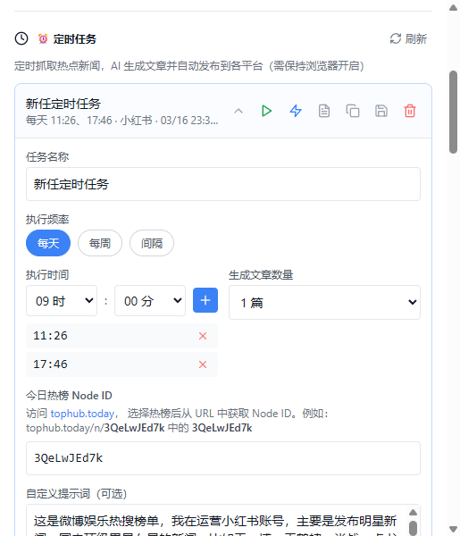
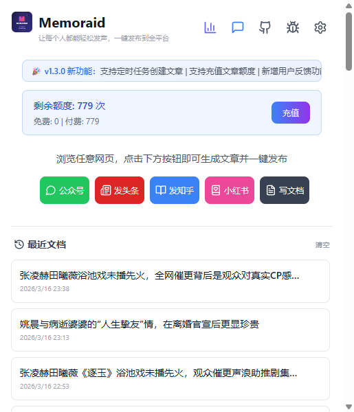
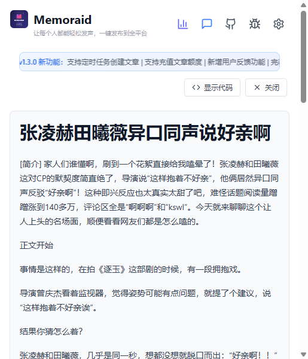
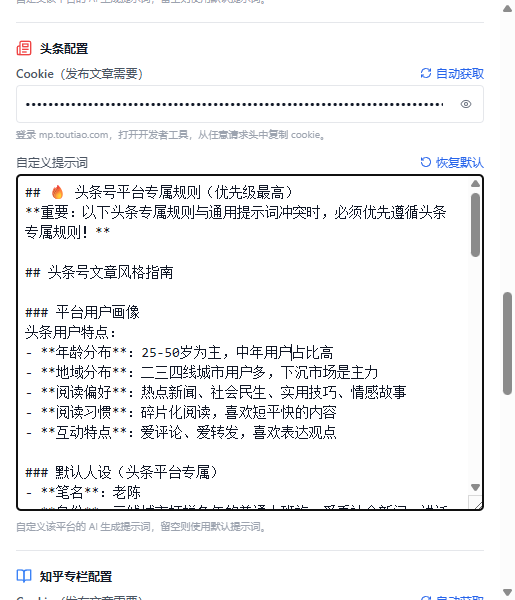
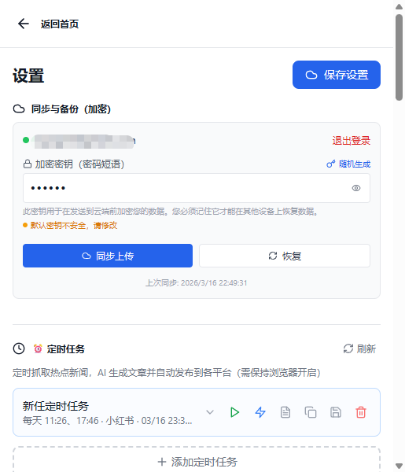

# Memoraid

一个面向中文创作者的 Chrome 扩展：提取网页内容、AI 生成文章、并一键发布到主流内容平台。

<div align="center">
  
</div>

[Chrome 应用商店安装](https://chromewebstore.google.com/detail/memoraid/leonoilddlplhmmahjmnendflfnlnlmg?hl=zh-CN&utm_source=ext_sidebar) |
[问题反馈](https://github.com/ralph-wren/memoraid/issues) |
[隐私政策](https://memoraid.dpdns.org/privacy)

## 最近更新 (v1.3.0)

### 🎯 核心新功能

- **🤖 智能定时任务**：支持多平台热门内容订阅，AI 自动选择优质素材，定时生成并自动发布文章
- **📰 热门内容订阅**：接入今日热榜聚合平台，覆盖微博、知乎、B站等 50+ 热门内容源
- **✨ AI 智能选题**：从热门话题中智能筛选符合创作方向的素材，提升内容质量
- **🎨 自定义提示词**：为每个平台单独配置提示词，精准控制文章风格和表达方式
- **⏰ 全自动发布**：定时任务自动抓取、生成、发布，真正实现无人值守的内容创作
- **� 安全可靠**：使用浏览器插件方式，在用户自己的浏览器环境中操作，避免被平台识别为机器人或环境异常
- **�💰 额度体系**：支持免费额度 + 充值额度，透明的使用统计
- **📊 数据统计**：Token 消耗、文章统计与排行榜，全面掌握创作数据

### 🔧 优化改进

- 优化多平台稳定性和整体 UI 响应体验
- 新增用户反馈模块：支持提交、查看与处理反馈
- 完善小红书发布流程，支持笔记简介和话题标签

## 核心能力

### 🎯 智能内容创作

- **智能提取**：支持网页正文提取和 AI 对话内容提取（ChatGPT/Gemini/DeepSeek 等）
- **AI 生成**：可生成技术文档或自媒体文章，支持多种主流模型（OpenAI、Claude、Gemini 等）
- **风格可控**：提供 6 维度滑条，调节语气、立场、情感与表达方式
- **自定义提示词**：为每个平台单独配置提示词，精准控制文章风格（如小红书的轻松风格、知乎的专业风格）

### 🤖 全自动定时任务

- **热门内容订阅**：接入今日热榜、NewsNow 等聚合平台，覆盖 50+ 热门内容源
  - 支持微博热搜、知乎热榜、B站热门、抖音热点等
  - 支持按分类筛选（科技、娱乐、财经、体育等）
- **AI 智能选题**：从热门话题中自动筛选符合创作方向的优质素材
- **定时自动发布**：设置执行时间，自动完成抓取→生成→发布全流程
- **多平台同步**：一次配置，同时发布到头条、知乎、微信、小红书等多个平台
- **无人值守**：真正实现 24/7 自动化内容创作，解放双手
- **🔒 安全可靠**：使用浏览器插件方式，在用户自己的浏览器环境中操作，避免被平台识别为机器人

### 📤 一键发布

- **多平台支持**：头条号、知乎专栏、微信公众号、小红书等主流平台
- **智能填充**：自动填充标题、正文、图片、话题标签等
- **自动发布**：支持生成后自动点击发布按钮，无需人工干预
- **平台适配**：针对每个平台的特点优化内容格式（如小红书的简介、话题标签）
- **🔒 安全可靠**：使用浏览器插件方式，在用户自己的浏览器环境中操作
  - 使用真实的浏览器环境和用户登录态，避免被平台识别为机器人
  - 不需要提供账号密码，只使用浏览器已登录的 Cookie
  - 模拟真实用户操作，降低账号异常风险
  - 所有操作在本地浏览器完成，数据不经过第三方服务器

### 💾 数据管理

- **历史记录**：本地保存所有生成的文章，支持搜索和导出
- **云端同步**：支持 Google/GitHub 登录，端到端加密同步配置与数据
- **数据统计**：Token 消耗统计、文章数量统计、平台分布排行榜
- **GitHub 导出**：支持将文章导出到 GitHub 仓库

## 30 秒快速开始

### 基础使用（手动创作）

1. 在 Chrome 应用商店安装 Memoraid
2. 打开扩展设置，选择 AI 提供商并填入 API Key
3. 打开任意网页，点击 `Summarize & Export` 生成总结
4. 需要创作时点击 `Generate Article`，再选择目标平台发布

### 进阶使用（自动化创作）

1. 在扩展设置中配置各平台的 Cookie（自动抓取或手动填入）
2. 进入"定时任务"标签页，点击"新建任务"
3. 选择新闻源（今日热榜）、内容分类、发布平台
4. 设置执行时间（支持多个时间点，如每天 9:00、15:00、21:00）
5. 开启任务，系统将自动完成：
   - 从热门榜单抓取话题
   - AI 智能选择优质素材
   - 生成符合平台风格的文章
   - 自动发布到指定平台

## 功能截图

### 1. 智能定时任务
*支持多平台热门内容订阅，AI 自动选择素材，定时生成并发布*



### 2. 主界面与历史记录
*清晰的历史记录管理，支持搜索和导出*



### 3. AI 总结结果
*智能提取网页内容，生成结构化总结*



### 4. 文章风格设置
*6 维度滑条精准控制文章风格*


### 5. 自定义提示词
*为每个平台单独配置提示词，精准控制文章风格*



### 6. 自动发布到头条等各大平台
*自动填充标题、正文、图片，一键发布*


### 7. 账号登录与同步
*端到端加密的云端同步*



## 安装与开发

### 方式一：应用商店安装（推荐）

1. 访问 [Chrome 应用商店 - Memoraid](https://chromewebstore.google.com/detail/memoraid/leonoilddlplhmmahjmnendflfnlnlmg?hl=zh-CN&utm_source=ext_sidebar)。
2. 点击“添加至 Chrome”。

### 方式二：源码安装（开发者模式）

1. 克隆仓库

```bash
git clone https://github.com/ralph-wren/memoraid.git
cd memoraid
```

2. 安装依赖

```bash
npm install
```

3. 构建扩展

```bash
npm run build
```

4. 在 Chrome 中加载
- 打开 `chrome://extensions/`
- 启用右上角“开发者模式”
- 点击“加载已解压的扩展程序”
- 选择项目下的 `dist` 目录

5. 生成发布包（可选）

```bash
npm run release
```

## 配置说明

### 基础配置

1. 开箱即用，新用户享免费文章生成额度

### 平台发布配置（可选）

要使用自动发布功能，需要先配置平台 Cookie：

1. 先在目标平台网页中完成登录
2. 在扩展设置中执行 `Auto Fetch` 自动抓取 Cookie
3. 若自动抓取失败，再手动粘贴 Cookie

支持的平台：
- 头条号 (mp.toutiao.com)
- 知乎专栏 (zhuanlan.zhihu.com)
- 微信公众号 (mp.weixin.qq.com)
- 小红书创作者平台 (creator.xiaohongshu.com)

### 自定义提示词配置（可选）

为每个平台单独配置提示词，精准控制文章风格：

1. 在扩展设置中找到对应平台的"自定义提示词"输入框
2. 输入你的提示词，例如：
   - 小红书：`请用轻松活泼的语气，多用短句和分段，适合年轻人阅读`
   - 知乎：`请用专业严谨的语气，提供深度分析和数据支持`
   - 微信公众号：`请用温和亲切的语气，适合公众号读者`
3. 点击 `Save Settings` 保存

### 定时任务配置（可选）

实现全自动内容创作：

1. 进入"定时任务"标签页，点击"新建任务"
2. 配置任务参数：
   - **任务名称**：给任务起个名字
   - **新闻源**：今日热榜
   - **内容分类**：选择感兴趣的分类（科技、娱乐、财经等），填入对应NODE ID
   - **发布平台**：选择要发布的平台（支持多选）
   - **执行时间**：设置定时执行的时间点（支持多个）
   - **文章数量**：每次执行生成的文章数量
3. 开启任务，系统将在指定时间自动执行

### 云端同步配置（可选）

1. 点击 `Google Login` 或 `GitHub Login`。
2. 设置加密密钥。
3. 点击 `Sync Up` 上传配置与数据。

## 常用命令

```bash
npm run dev      # 本地开发
npm run build    # 构建与类型检查
npm run release  # 生成发布包
```

## 权限说明（与 manifest 对齐）

| 权限 | 用途 |
|------|------|
| `storage` | 存储本地设置、历史记录和缓存数据 |
| `activeTab` | 读取当前标签页内容用于提取与总结 |
| `cookies` | 获取发布平台登录态，用于自动填充与发布 |
| `identity` | 支持 Google/GitHub OAuth 登录同步 |
| `alarms` | 支持定时抓取与定时发布任务 |
| `scripting` | 在目标页面注入脚本以执行自动化填充 |
| `host_permissions` (`<all_urls>`) | 支持任意网页提取、跨站资源访问与多平台发布 |

## 隐私与安全

- **本地优先**：API Key 与核心配置默认仅存储在本地
- **端到端加密**：云端同步数据使用用户密钥加密
- **直接通信**：浏览器直接与 AI 提供商通信，不经中转服务
- **最小必要**：仅申请实现功能所需的扩展权限
- **🔒 真实环境操作**：
  - 使用浏览器插件方式，在用户自己的浏览器中操作
  - 使用用户已登录的 Cookie，不需要提供账号密码
  - 模拟真实用户行为，避免被平台识别为机器人
  - 所有发布操作在本地浏览器完成，不经过第三方服务器
  - 降低账号异常和环境检测风险

## 项目结构

```text
src/
  popup/         # 扩展主界面 (React)
  content/       # 各平台内容脚本
  background/    # 后台 Service Worker
  utils/         # API、存储、提示词等工具模块
backend/         # Cloudflare Worker 后端
docs/            # 项目文档
```

## 贡献指南

1. Fork 仓库并创建分支：`git checkout -b feature/xxx`
2. 完成开发并提交：`git commit -m "feat: xxx"`
3. 推送分支并发起 Pull Request。

## 许可证

MIT，详见 [LICENSE](./LICENSE)。

## 联系方式

- GitHub Issues: [提交问题](https://github.com/ralph-wren/memoraid/issues)
- Email: iuyuger@gmail.com
